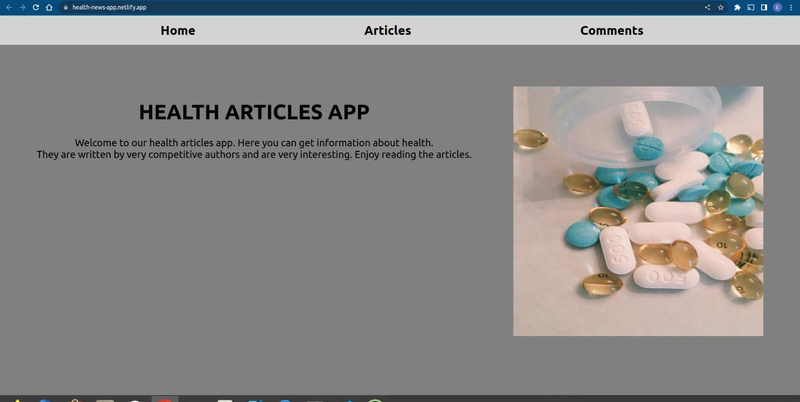
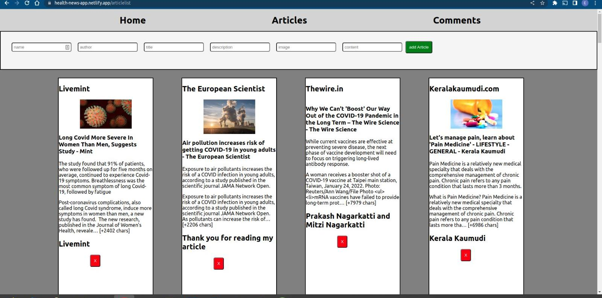

# Health Articles App
***

## Contributors of this Project
***
### 1. Marvyn Kiplagat
### 2. Beatrice Paul
### 3. Sarah Wambui
### 4. Erick Gathua
***
### Description
***
Moringa Phase 2 group project on Health Articles Website that allows users to:

    - view articles "Get/articles"
    - Create their own article "Post/articles"
    - Review the article "Patch/articles"
    - Delete the article "Delete/articles"

### Setup Requirements
***
    - Git
    - Github
    - Web Browser (Chrome or Firefox)
    - React .js
    - JSON Server
    - Code Editor

### Setup Installation  
***
- Copy the link of this repository
"[https://github.com/sarahwambui96/health-articles-app]"  
- Clone it to your local machine
"git clone [https://github.com/sarahwambui96/health-articles-app]"
- Open terminal and navigate to the directory of this project
"cd health-articles-app"
- Run the following command to install the JSON Server
"npm install -g json-server"
- Start the JSON Server
"json-server --watch db.json"

- To view the server, navigate to [http://localhost:3000/articles]
- To run the application, open the files on your browser using a suitable code editor ie  [https://code.visualstudio.com/]

- To view it live in browser [https://health-news-app.netlify.app/]

# Getting Started with Create React App

## Available Scripts
***
In the project directory, you can run: 
### `npm install`
### `npm start`

Runs the app in the development mode.\
Open [http://localhost:3000/articles]to view it in your browser.

The page will reload when you make changes.\
You may also see any lint errors in the console.

### Some Screenshots
  - Homepage section
  
  
  - Article section
  

  - Comment section
  

### Known Bugs
***
There are no known bugs of this project at the moment 

### License
***
Copyright (c) 2022 Moringa School

Permission is hereby granted, free of charge, to any person obtaining a copy of this software and associated documentation files (the "Software"), to deal in the Software without restriction, including without limitation the rights to use, copy, modify, merge, publish, distribute, sublicense, and/or sell copies of the Software, and to permit persons to whom the Software is furnished to do so, subject to the following conditions:

The above copyright notice and this permission notice shall be included in all copies or substantial portions of the Software.

THE SOFTWARE IS PROVIDED "AS IS", WITHOUT WARRANTY OF ANY KIND, EXPRESS OR IMPLIED, INCLUDING BUT NOT LIMITED TO THE WARRANTIES OF MERCHANTABILITY, FITNESS FOR A PARTICULAR PURPOSE AND NONINFRINGEMENT. IN NO EVENT SHALL THE AUTHORS OR COPYRIGHT HOLDERS BE LIABLE FOR ANY CLAIM, DAMAGES OR OTHER LIABILITY, WHETHER IN AN ACTION OF CONTRACT, TORT OR OTHERWISE, ARISING FROM, OUT OF OR IN CONNECTION WITH THE SOFTWARE OR THE USE OR OTHER DEALINGS IN THE SOFTWARE.
